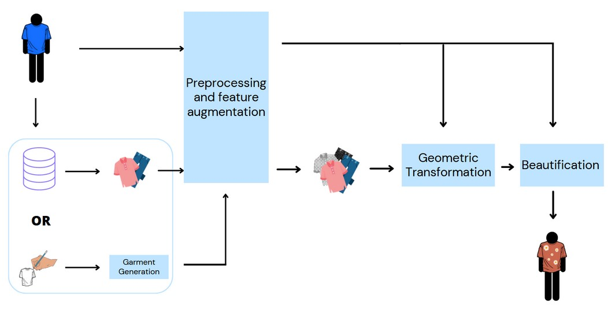
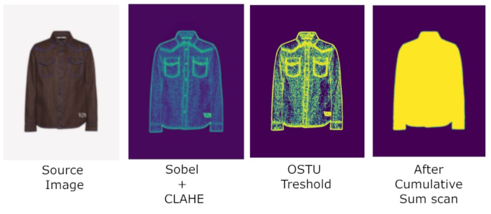
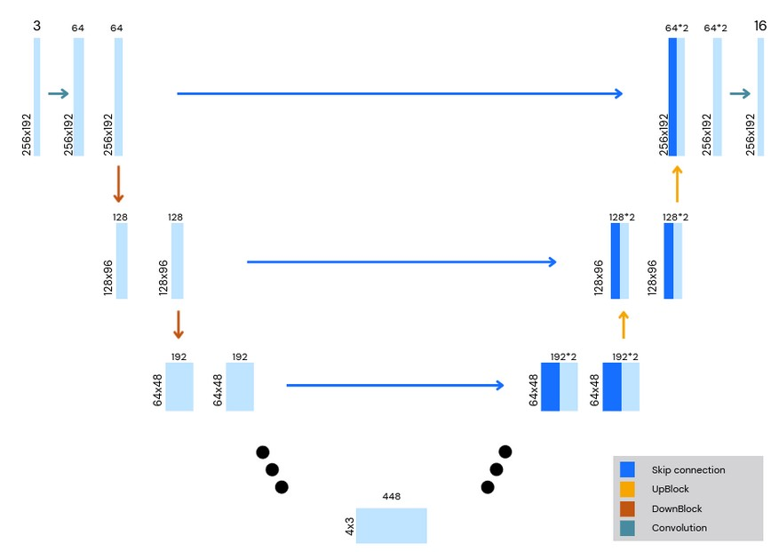
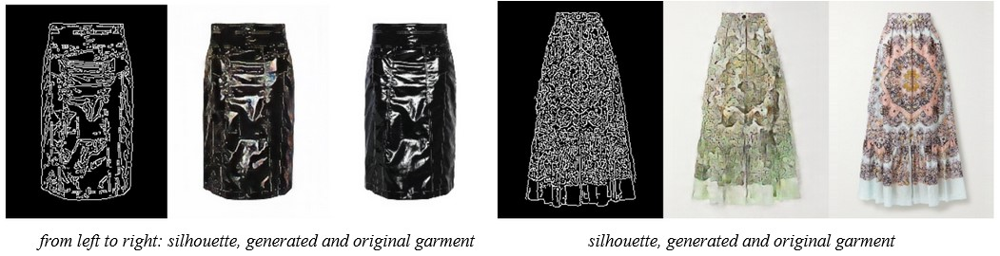
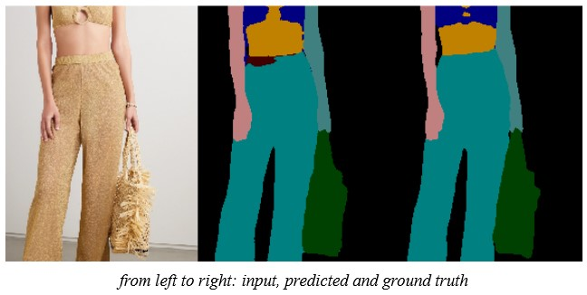
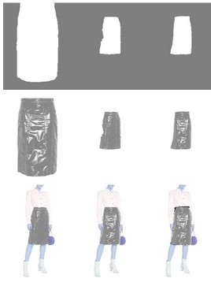
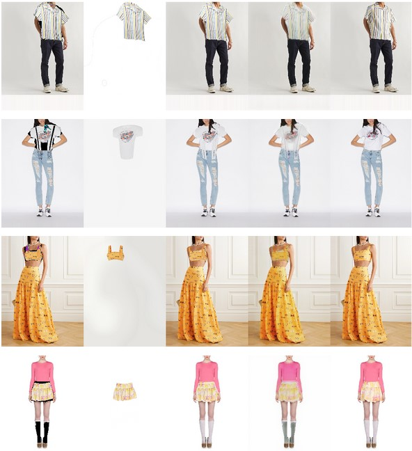

# Virtual Try On - ComputerVision & CognitiveSystems project

### Contributors:
- [Giulio Querzoli](https://github.com/Giurzo)
- [Mirco Botti](https://github.com/JCobot)

## Abstract
One of the biggest fears of buying clothes online is the lack of trying them before the purchase. This project aims to help customers to perform a virtual try on before the purchase and help stylists to create and try new clothes on virtual models starting with a simple silhouette.  

We created a linear pipeline, all the steps aim to keep code the simplest possible, trying to generalize and increase the situation in which the system can perform, especially from the customer point of view. 
We want to provide good results even without powerful cameras and with photos taken from amatour. 

We used a first version of the Unimore dataset [Dress Code: High-Resolution Multi-Category Virtual Try-On](https://aimagelab.ing.unimore.it/imagelab/page.asp?IdPage=47), in fact the dataset version provided to us does not have all the feature of the original one but we take the challenge to create a good system with limited resources. 

For More info --> [Project Presentation](Presentation.pdf)

## Architecture

## Preprocessing
We resized the images from 768x1024 pixels to 192x256, we normalized their rgb values into the range [0,1] and changed the shape using channel first modality to make it easily managed by the networks in Pytorch.

We also added additional features like the source and target cloth’s mask, one throught the model's semantic segmentation and the other one, after many trial, with a method that we called **cumulative sum**. If you are interested to see the other methods check our [project presentation](Presentation.pdf)

## Custom U-Net
During the project we decided to use the same architecture for different tasks, from segmentation to generation or beautification of new garments. The architecture chosen is a variation of the U-net used in [Pix2Pix](https://arxiv.org/pdf/1611.07004v3.pdf) that uses less parameters w.r.t the original one. 
The architecture of the network is composed by an initial convolutional layer that preserves the original dimensions of the image but increases its channels and, after a Batch Normalization and a Leaky ReLu, a series of DownBlock layers that reduces the image to a desired dimension and increase receptive field. In order to reconstruct the image a series of UpBlock layers with skip connections are performed and, as a final step, a convolution layer is done.

## New Garments
At the beginning of our pipeline you can choose if you want to try a garment taken from the dataset or a brand new garment. 
The process to create a new cloth star from a simple sketch or a contour of an existing cloth image (preprocessed with canny) that is passed through a GAN having as a generator our U-Net variation with 6 DownBlock and as output size an rgb image (256x192x3).

## Retrieval
We used the concept of armocromia in order to suggest the most fittable cloth, basing the system choice on the model’s hair and skin colors. As a feature vector we used a discretized color histogram. We computed the cosine distance between other models’ feature vectors and selected the top 10 of them.

## Semantic Segmentation
We implemented the semantic segmentation of the target image to have the possibility to detect cloth on it and use it to distort other cloth.
In this part we tried different implementations and computed metrics in a way to compare different methods. All this method starts from our U-Net.

## Wraping Module
One of the most important parts of our pipeline is the warping module that is responsible, given an initial representation of an object c to warp it as close as possible to the same item m fitted to a model. As a warping function we used the Thin Plate Spline (TPS), a common CNN for geometric matching widely used for virtual try on. Despite lots of models giving as input additional information about the target model like the agnostic representation ([VITON](https://github.com/xthan/VITON)) we decided to keep this part as simple as possible and give as input only the target and source masks computed during the preprocessing phase.  

## Beautification
The last step is the beautification part. This step is necessary to remove the wrong border and clear semantic problems like dress-over-arm. The module consists, like other parts of the pipeline in a GAN with 6 layer U-Net variation.

## Conclusion
This project is just a starting point to a more complex pipeline for virtual try on. We tried to take all the steps simple and use fewer features as possible in a manner that everyone can use it. To improve the model’s generalization an extra step in the data preparation can be done: modify the background in order to have a different ones for every image, that's because a general user, especially if they want to do the try on during online shopping, doesn’t always have a white background.
Even in the garment generator module a lot of future improvements can be done, for instance providing an image to take inspiration or a texture to imitate.

